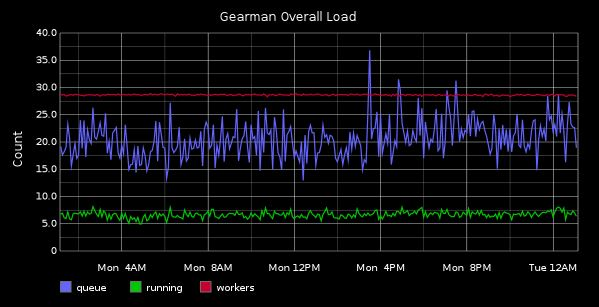

# PHP statsd gearman metrics collector

[](https://travis-ci.org/petrica/php-statsd-gearman)

Gearman metrics collector for statsd written in PHP.

Install using composer:
-----------------------

```shell
composer require petrica/statsd-gearman
```

Requirements:
-------------

* PHP ^5.5

Run with:
---------

```shell
vendor/bin/statsd-console statsd:notify --verbose gauges.yml
```

Please have a look at the main statsd library [here](https://github.com/petrica/php-statsd-system).

Sample config file:
-------------------

The configuration file is pretty straightforward, you specify the gauge class name and class arguments

```yml
gauges:
    gearman:
        class: Petrica\StatsdGearman\Gauge\GearmanGauge
        arguments:
            server: localhost:4730
            timeout: 1
```

Where we have the following parameters:

**server** - Gearman server host and port
```
server: [host]:[port]
```

**timeout** - Connection timeout in seconds
```
timeout: [seconds]
```

Graphite
--------

Having statsd integrated with graphite, you will find gearman metrics under:

```
stats.gauges.system.gearman.[job_name].queue - number of jobs in queue
stats.gauges.system.gearman.[job_name].running - number of running workers
stats.gauges.system.gearman.[job_name].workers - number of available workers
```

Here is an example of how a graph might look like for all stats aggregated:



In this example we have 27 available workers, around 20 jobs in queue and around 7 active workers every 5 minutes.
Of course this example doesn't tell much about gearman load, but tracking each job individually will get
you enough information to know if you need to span additional workers in order to keep up with the flow of jobs. 

Here is the graph URL:

```
/render?width=600&from=-24hours&until=now&height=300&target=aliasByNode(summarize(sumSeries(stats.gauges.system.gearman.*.queue)%2C%20%225minutes%22%2C%20%22avg%22%2C%20true)%2C5)&target=aliasByNode(summarize(sumSeries(stats.gauges.system.gearman.*.running)%2C%20%225minutes%22%2C%20%22avg%22%2C%20true)%2C5)&target=aliasByNode(summarize(sumSeries(stats.gauges.system.gearman.*.workers)%2C%20%225minutes%22%2C%20%22avg%22%2C%20true)%2C5)&title=Gearman%20Overall%20Load&vtitle=Count&_uniq=0.5637446563409128
```
